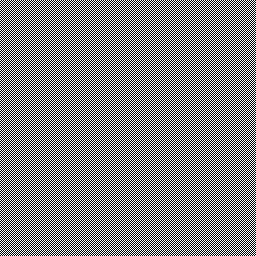

This repo compares various image-resizing tools to see which do a good job.
Specifically, we want to know which properly handle
[gamma](https://www.teamten.com/lawrence/graphics/gamma/) in 8-bit images.

We create a one-pixel checkerboard pattern and resize it down by a factor of
two. This should create an image with values of 128 in poor resizers and
186 in good resizers.

Here's the original 512×512 image:

The Python Imaging Library (PIL) resizes it down this 256×256 image:

This is what Java's `Graphics2D.drawImage()` method creates:

ImageMagick's `convert` program generates this version:

All of the above are much too dark. Here is a straightforward 256×256
checkerboard (not resized) and it's much lighter than any of the above
images:

The only solution that worked was using ImageMagick with the `-gamma 2.2`
flag:

If you load this version and the small checkerboard into an image viewing
program, squint, and switch back and forth, you'll see that they're about
the same brightness.

