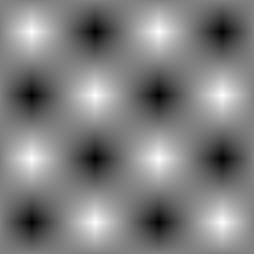
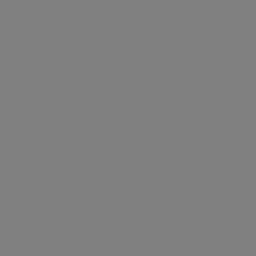
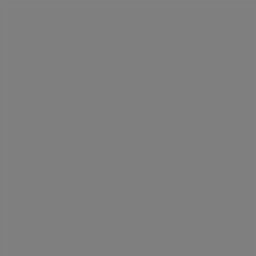

# Image resize test

This repo compares various image-resizing tools to see which do a good job.
Specifically, we want to know which properly handle
[gamma](https://www.teamten.com/lawrence/graphics/gamma/) in 8-bit images.

We create a one-pixel checkerboard pattern and resize it down by a factor of
two. This should create an image with values of 128 in poor resizers and
186 in good resizers.

Here's the original 512×512 image:

The Python Imaging Library (PIL) resizes it down this 256×256 image:

This is what Java's `Graphics2D.drawImage()` method creates:

ImageMagick's `convert` program generates this version:

All of the above are much too dark. Here is a straightforward 256×256
checkerboard (not resized) and it's much lighter than any of the above
images:

The only solution that worked was using ImageMagick with the `-gamma 2.2`
flag:

If you load this version and the small checkerboard into an image viewing
program, squint, and switch back and forth, you'll see that they're about
the same brightness.

Apparently
[Photoshop is broken](http://www.kiransprojects.com/blog/2014/photoshop-blending-is-broken/) too.

# License

Copyright 2018 Lawrence Kesteloot

Licensed under the Apache License, Version 2.0 (the "License");
you may not use this file except in compliance with the License.
You may obtain a copy of the License at

   http://www.apache.org/licenses/LICENSE-2.0

Unless required by applicable law or agreed to in writing, software
distributed under the License is distributed on an "AS IS" BASIS,
WITHOUT WARRANTIES OR CONDITIONS OF ANY KIND, either express or implied.
See the License for the specific language governing permissions and
limitations under the License.

